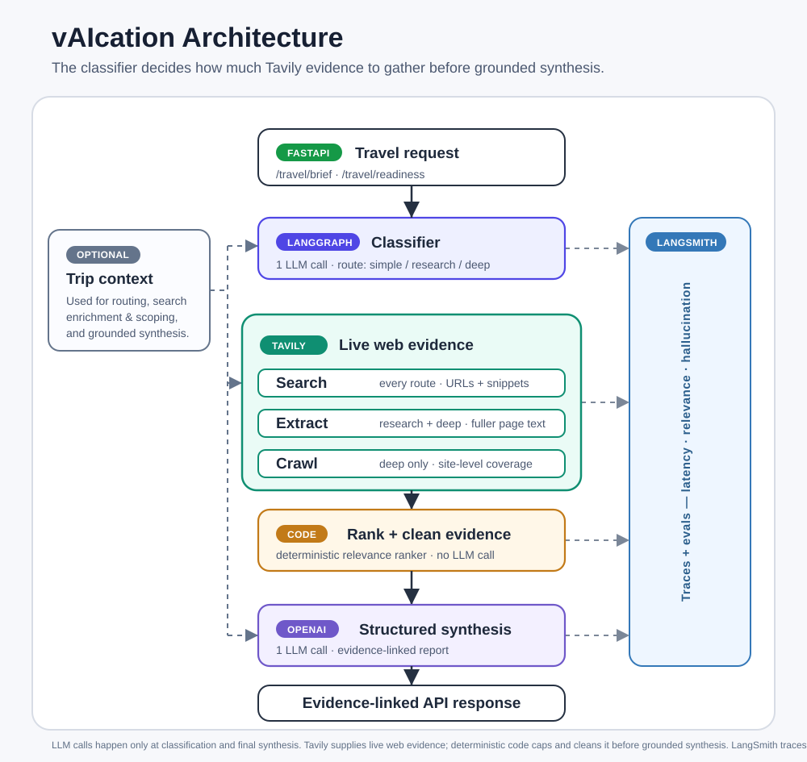

# vAIcation

vAIcation is a small travel-intelligence API built on Tavily, LangGraph, and
LangSmith. The main goal is not itinerary planning. The useful question is:
after a business trip has been booked, what has changed that might affect it?

The project started from the provided ReAct-style web agent. That agent had
Tavily Search, Extract, and Crawl available, but it could call them repeatedly
with little control over cost or latency. I added tracing first, then replaced
the open-ended agent loop with a routed graph.

Final snapshot: 96% routing agreement, latency 32.4s -> 20.1s on the matched
sample, and hallucination flag rate 0.75 -> 0.574, where lower is better.
Details and reproduction in [TECHNICAL_STATEMENT.md](./TECHNICAL_STATEMENT.md).

## Technical Statement

See [TECHNICAL_STATEMENT.md](./TECHNICAL_STATEMENT.md) for the full writeup:
what changed, why the routing design was chosen, benchmark results, and what
would still need work before production.

## Files

```text
app.py                  # Original ReAct agent, kept as the baseline
app_v2.py               # Routed LangGraph implementation
baseline.py             # Runs the original agent against a benchmark sample
benchmark.py            # Runs the routed graph against the 25-case eval set
compare.py              # Pulls baseline/routed trace metrics from LangSmith
eval_results.py         # Pulls LangSmith evaluator scores for a benchmark run
docs/architecture.svg   # High-level architecture diagram
.env.example            # Environment variable template
TECHNICAL_STATEMENT.md  # Main writeup
test_routing.py         # Unit tests for routing, scoping, ranking, and output contract
```

## What Changed

The original app let the model decide which tool to call at each step. That is
useful for exploration, but it makes serving behavior hard to predict. A simple
query can still trigger multiple LLM calls and repeated search calls.

`app_v2.py` uses a small classifier up front. It chooses one of three routes:

```text
START -> classify -> search -----> synthesize                      (simple)
                            \-> extract -----> synthesize          (research)
                                      \-> crawl -> synthesize       (deep)
```

| Tier       | Tools run                | Use case                                  |
|------------|--------------------------|-------------------------------------------|
| `simple`   | search                   | One factual lookup or current check       |
| `research` | search, extract          | Comparison or synthesis across pages      |
| `deep`     | search, extract, crawl   | Multi-domain trip risk assessment         |

The key distinction is scope. A single airport disruption question is usually
`research`. A full trip readiness question across transport, weather, safety,
entry rules, and logistics is `deep`.

At a high level, the classifier decides how much Tavily evidence to gather.
Search runs once for every request; Extract and Crawl are added only when the
route needs fuller page or site-level evidence.



## Trip Context

Readiness checks can include a booked trip:

```json
{
  "booking_ref": "PNR-7QF4K2",
  "traveler": "J. Okafor",
  "origin": "JFK",
  "destination": "LHR",
  "depart_date": "2026-06-15",
  "return_date": "2026-06-20",
  "carriers": ["British Airways", "American Airlines"],
  "hotel": "Sofitel London Heathrow",
  "booked_at": "2026-05-20"
}
```

When trip context is present, readiness search is scoped to what changed since
`booked_at` and, for narrow routes, biased toward authoritative news sources
and the booked carriers. In a real deployment, that trip object would come from
a travel-management or booking system.

The search text is also enriched from the trip when needed. If the user asks a
vague readiness question like "what changed since booking?", the graph appends
missing route, date, hotel, and carrier terms before search. On the deep route,
it also adds broad risk-domain terms because that path is meant to cover several
domains at once.

After Tavily returns results, the app applies a small deterministic relevance
ranker before extraction, crawl, and synthesis. It prefers evidence that matches
the trip, route, carrier, date, or risk domain. This is intentionally not an LLM
reranker; it keeps the cost model predictable and reduces noisy evidence before
the final synthesis call.

## Output Contract

The response is structured for downstream systems, but it deliberately stops
short of making customer policy decisions. The LLM returns evidence-linked
facts and recommendations. A separate policy layer should decide owner, alert
priority, SLA deadline, escalation path, or final trip status.

Example response shape:

```json
{
  "query": "Is there a rail strike in the UK this week?",
  "workflow": "readiness",
  "classification": "simple",
  "report": {
    "summary": "No retrieved source reports a major UK rail strike this week.",
    "key_findings": [
      "One retrieved source reports no major UK rail strikes today.",
      "Another source says no industrial action is currently planned."
    ],
    "risks": [
      {
        "category": "transport",
        "severity": "low",
        "summary": "Local engineering works can still cause disruption even without a national strike.",
        "affected_leg": null,
        "evidence_url": "https://www.thetrainline.com/trains/great-britain/industrial-action",
        "confidence": "medium"
      }
    ],
    "recommendations": [
      {
        "action": "Check National Rail Enquiries before travel for live route status.",
        "rationale": "The retrieved evidence says industrial action is not currently planned, but local works can still affect travel.",
        "related_risk": "Local engineering works can still cause disruption even without a national strike.",
        "evidence_url": "https://www.thetrainline.com/trains/great-britain/industrial-action",
        "confidence": "medium"
      }
    ],
    "sources": [
      "https://striketracker.app/strikes-in-united-kingdom",
      "https://www.thetrainline.com/trains/great-britain/industrial-action"
    ]
  }
}
```

## Why Tavily

Travel questions often depend on current web information: strikes, airport
delays, severe weather, advisories, visa changes, or event-driven hotel demand.
Tavily is useful here because it returns search, extracted page content, and
crawl output in a form that is already usable by an LLM.

The three Tavily tools map cleanly to the three routes:

- `TavilySearch`: broad current lookup
- `TavilyExtract`: full content from selected URLs
- `TavilyCrawl`: broader site retrieval for the deepest route

The router is there to keep those tools from being used when they are not
needed.

## Observability

LangSmith tracing is enabled through environment variables. The traces are used
for two things:

- seeing which route and tools fired for each request
- comparing LLM calls, tool calls, and latency between the original agent and
  the routed graph

The project also uses LangSmith-hosted LLM-as-judge evaluators for hallucination
and answer relevance. Those evaluators are configured in the LangSmith UI, not
version-controlled in this repo. `eval_results.py` pulls those evaluator scores
back down for a tagged benchmark run.

## API

| Method | Path                | Purpose                                             |
|--------|---------------------|-----------------------------------------------------|
| POST   | `/travel/brief`     | Planning-oriented travel research                   |
| POST   | `/travel/readiness` | One-time check of what changed since booking        |
| POST   | `/eval/run`         | Run the benchmark suite                             |
| GET    | `/health`           | Liveness check                                      |

Both travel endpoints use the same graph. The `workflow` changes the synthesis
prompt: planning brief vs. readiness assessment.

## Setup

Requires Python 3.10+.

```bash
python3 -m venv venv
source venv/bin/activate
pip install -r requirements.txt
```

Copy `.env.example` to `.env` and fill in the keys:

```bash
cp .env.example .env
```

```text
TAVILY_API_KEY=your_tavily_api_key_here
OPENAI_API_KEY=your_openai_api_key_here
LANGCHAIN_API_KEY=your_langsmith_api_key_here
LANGCHAIN_TRACING_V2=true
LANGCHAIN_PROJECT=vAIcation-enterprise-travel-intelligence-api
```

## Running

```bash
python app_v2.py
```

The API starts on `http://localhost:8000`.

Example requests:

```bash
curl -X POST "http://localhost:8000/travel/brief" \
  -H "Content-Type: application/json" \
  -d '{"query": "Compare business class options from New York to Tokyo in September"}'

curl -X POST "http://localhost:8000/travel/readiness" \
  -H "Content-Type: application/json" \
  -d '{"query": "Monitor all disruption risks for a New York to London trip departing June 15"}'
```

With trip context:

```bash
curl -X POST "http://localhost:8000/travel/readiness" \
  -H "Content-Type: application/json" \
  -d '{
    "query": "What operational risks have emerged since this trip was booked?",
    "trip": {
      "booking_ref": "PNR-7QF4K2",
      "traveler": "J. Okafor",
      "origin": "JFK",
      "destination": "LHR",
      "depart_date": "2026-06-15",
      "return_date": "2026-06-20",
      "carriers": ["British Airways", "American Airlines"],
      "hotel": "Sofitel London Heathrow",
      "booked_at": "2026-05-20"
    }
  }'
```

## Benchmarks

`benchmark.py` contains 25 labeled cases across the three routes and both
workflows.

| Tier       | Count | Workflow split        |
|------------|-------|-----------------------|
| `simple`   | 8     | 4 brief / 4 readiness |
| `research` | 9     | 4 brief / 5 readiness |
| `deep`     | 8     | 2 brief / 6 readiness |

Run the routed benchmark:

```bash
python benchmark.py --run-id my-run-id
```

Run the original agent sample, then compare matching LangSmith traces:

```bash
python baseline.py --run-id my-run-id
python benchmark.py --run-id my-run-id
python compare.py --run-id my-run-id
```

The comparison script matches baseline and routed traces by `run_id` and
`case_id`, then reports LLM-call counts, tool-call counts, and latency.

Pull evaluator results for a routed benchmark run:

```bash
python eval_results.py --run-id my-run-id
```

For routing agreement, call-count, latency, and evaluator results, see
[TECHNICAL_STATEMENT.md](./TECHNICAL_STATEMENT.md). Regenerate them against a
shared run ID with `baseline.py` / `benchmark.py` / `compare.py` (calls and
latency) and `eval_results.py` (evaluator scores).

## Tests

The unit tests do not call OpenAI or Tavily. They mock the classifier, reporter,
and Tavily tools, then run the real compiled graph.

```bash
pytest test_routing.py -v
```

The tests check:

- each route fires the expected tools once
- readiness search parameters are computed per request
- trip context reaches synthesis
- under-specified readiness queries are enriched from trip context
- search and evidence blocks are ranked before extract/crawl/synthesis
- the report schema uses evidence-linked risk/recommendation objects
- policy fields stay out of the LLM output contract

## Known Limitations

This is a focused routing and evaluation prototype, not a full travel platform.
The main gaps are:

- The response schema now emits evidence-linked facts, but customer-specific
  actions still need a deterministic policy layer for `trip_status`, owner,
  priority, and SLA.
- The relevance ranker is deliberately lightweight. A production version should
  use stronger source-quality signals and richer place/airport aliases before
  choosing what to extract or crawl.
- Simple factual queries still return the same full report schema as complex
  travel-risk queries. A production API would likely use a lighter response
  contract for the simple route.
- `/travel/readiness` is a one-time check. Continuous monitoring would require
  persisted trip state, scheduled checks, and diffing against prior results.
- LangSmith evaluator configuration lives in the UI. A production setup should
  version those evaluators with the code.
